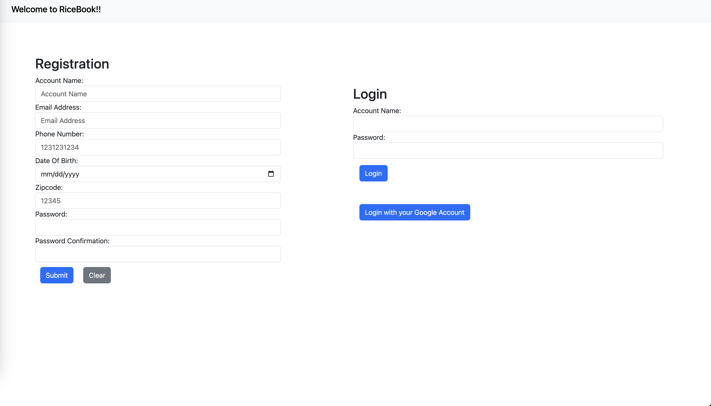
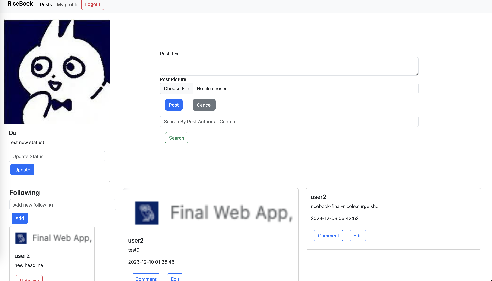
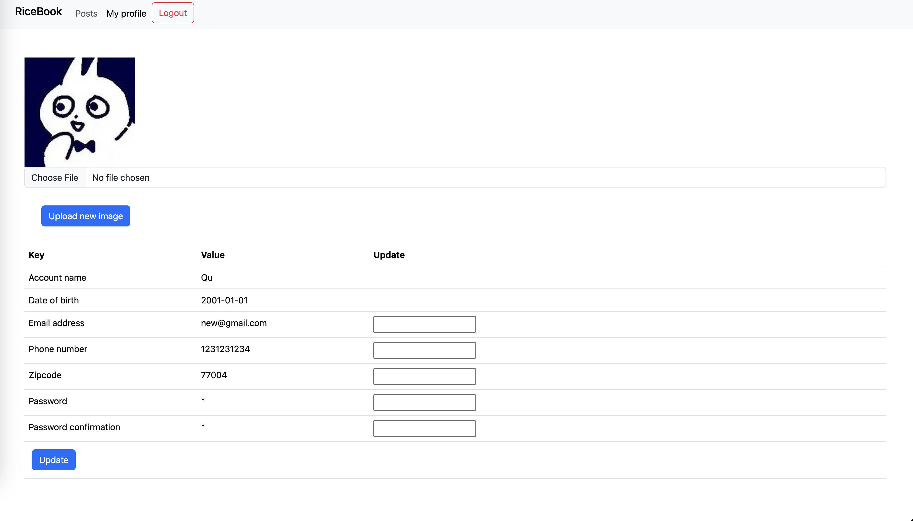

# RiceBook

RiceBook is a Facebook-like social media platform. 

Website: https://ricebook-final-nicole.surge.sh/

Credentials for test AND users to follow
| username    | password |
| -------- | ------- |
| user2  | world    |
| user3 | world     |
| a123    | 123    |
| Qu|1234|

## Table of Contents

- [Features](#features)
- [Frontend](#Frontend)
- [Backend](#backend)
- [IOS_version_(still_under_construction)](#IOS_version_(still_under_construction))

## Features

It has three views: Landing, Main and Profile.

### Landing

- Registration
- Login (Google third-party authentication supported)

### Main

- Display the posts by yourself and your following users
- Follow and unfollow users
- Post new text-only or text + image posts
- Edit your own post
- Comment on other's post
- A search box which filters the displayed articles by text or author
- Pagination (10 posts per page)
- Update your status

### Profile

- Check and Edit your profile (avatar, phone, password, etc.)

## Frontend

- Utilizes the power of [React](https://reactjs.org/) to create an intuitive and responsive user interface.
- Implements UI components with [React-Bootstrap](https://react-bootstrap.github.io/) for a sleek and modern look.
- Enhances user experience with [React-Toastify](https://fkhadra.github.io/react-toastify/) for real-time notifications.
- Ensures code quality with thorough testing using [Jest](https://jestjs.io/) for the frontend.
- Deployed using [Surge](https://surge.sh/) for seamless hosting and sharing.

## Backend

- Employs [Node.js](https://nodejs.org/) and [Express.js](https://expressjs.com/) for building a scalable and efficient backend.
- Utilizes [MongoDB Atlas](https://www.mongodb.com/cloud/atlas) for efficient and reliable database management.
- Efficiently saves images for posts and avatars using [Cloudinary](https://cloudinary.com/) for seamless image management.
- Ensures secure password storage by employing [MD5](https://en.wikipedia.org/wiki/MD5) encryption.
- Implements third-party user authentication and authorization with [Passport.js](http://www.passportjs.org/) and OAuth 2.0 for enhanced security.
- Ensures code reliability through comprehensive unit testing with [Jasmine](https://jasmine.github.io/) for the backend.
- Hosted on [Heroku](https://www.heroku.com/) for a robust and scalable backend infrastructure.

## IOS_version_(still_under_construction)

- Extends the reach of RiceBook to iOS users with the iOS version developed using [Swift](https://developer.apple.com/swift/).

